# Course Apps
My applications from the course I took on Udemy. Course link is [here](https://www.udemy.com/share/101z9w3@HzV4fKC-3bzY7Cxj96GRHgXbyF85OB7SOUnW-Sq-9f5QC9NaXZcS-RRA0oH__U5S/) .  
### 1st App
The goal of this UIKit-created application was to comprehend the <b>protocol oriented programming</b> framework.  

   
   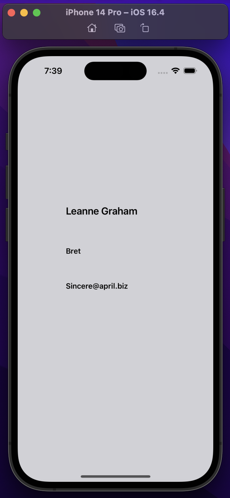

### 2nd App
The goal of  application was to comprehend the <b>core data</b> and ids.  

   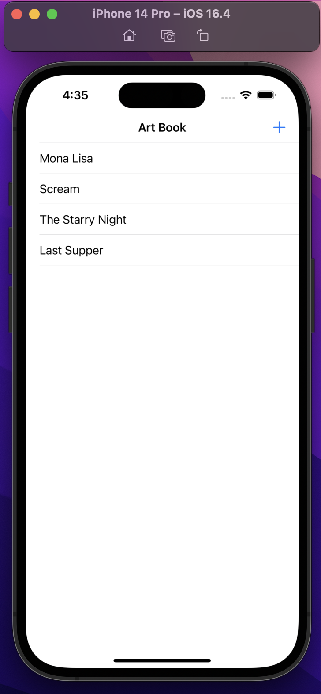
   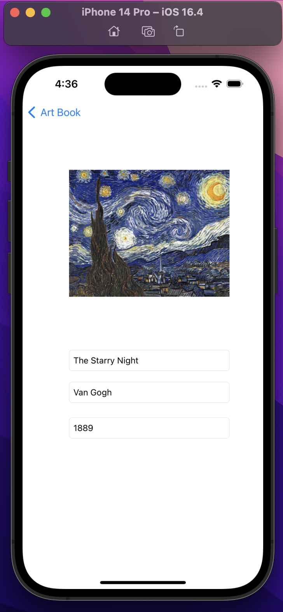
   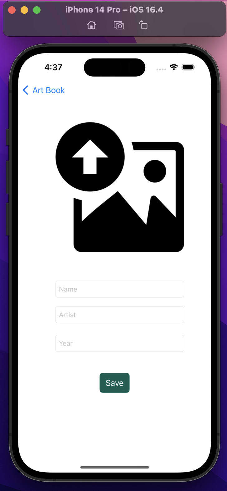
   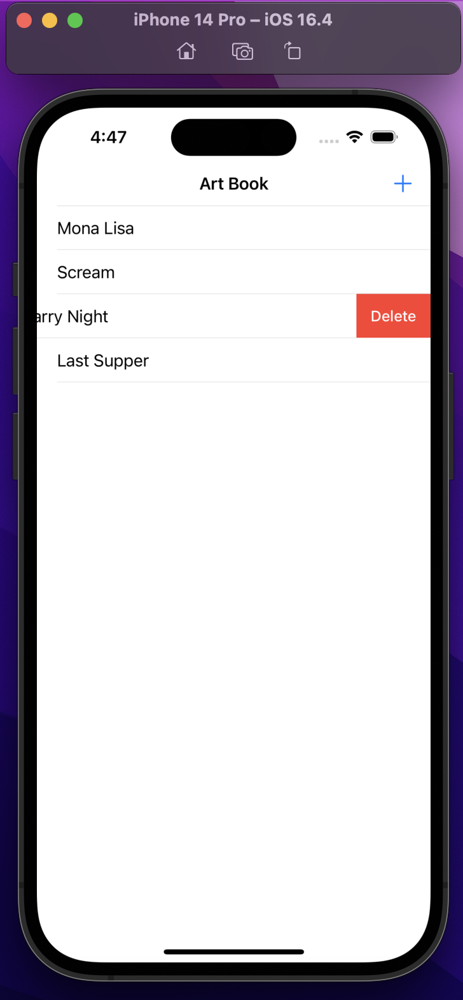

### 3rd App
The goal of  application was to using <b>maps</b>.  

   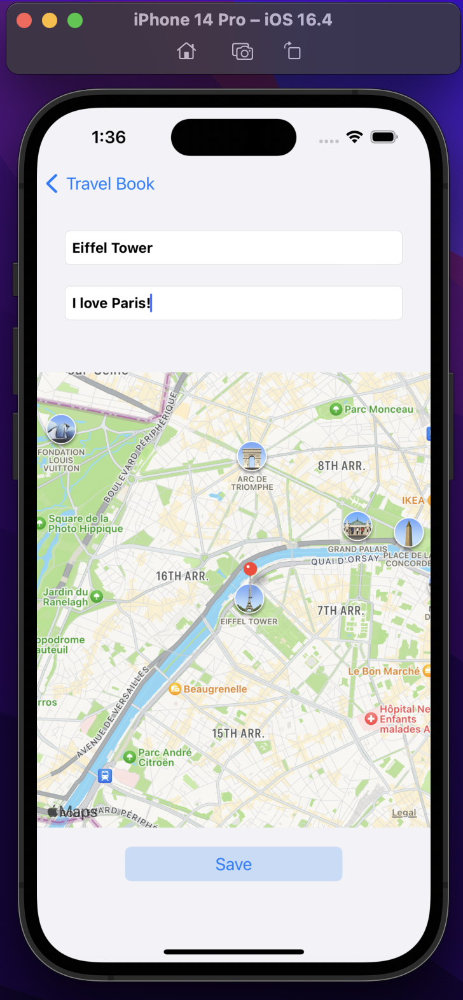
   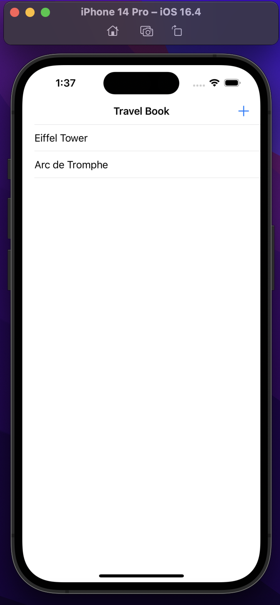
   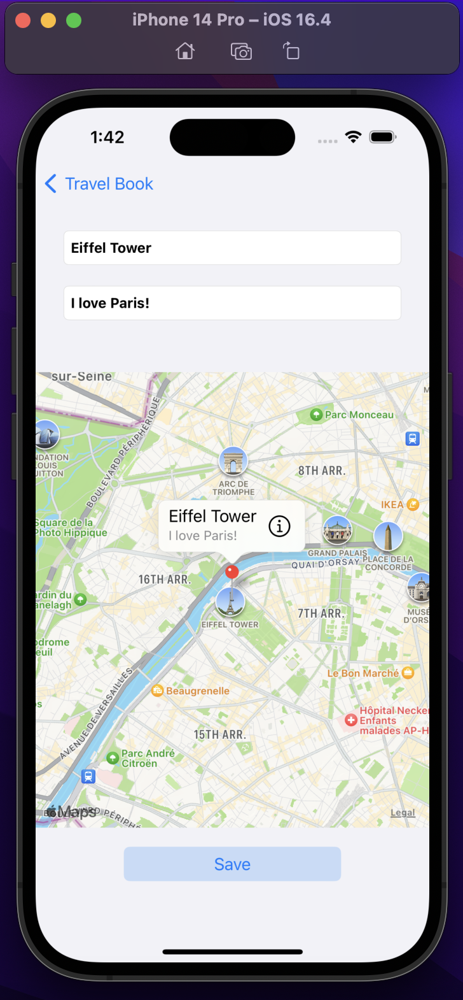
   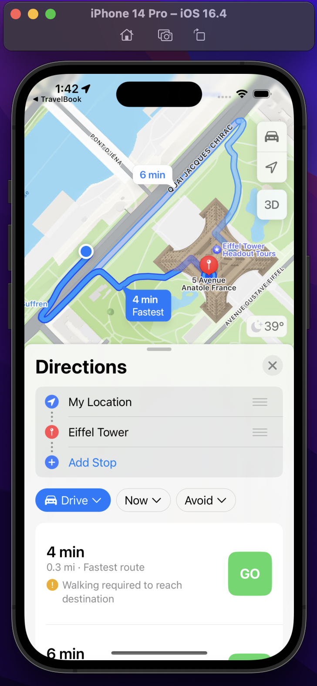

### 4th App
The goal of  application was to using <b>API</b> and <b>URLSession</b>. An application that fetches currency values ​​using API.  

   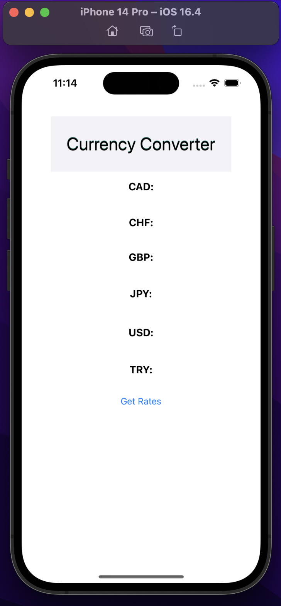
   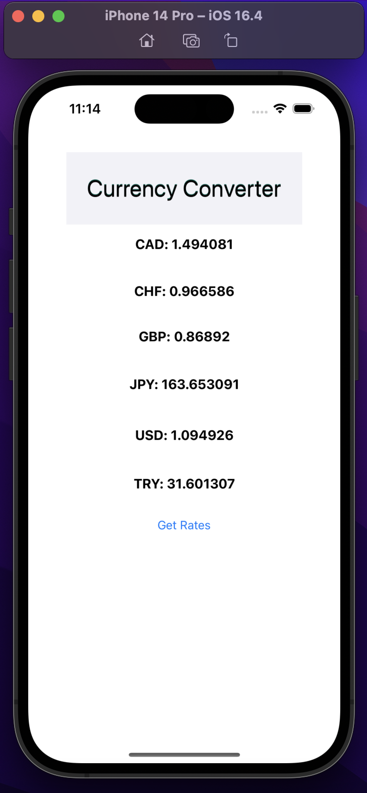

### 5th App
The goal of  application was to using <b>Firebase (Authentication, Storage, Firestore)</b>, <b>CocoaPods</b>, <b>Swift Package Manager</b> and <b>SDWebImage</b>. 

   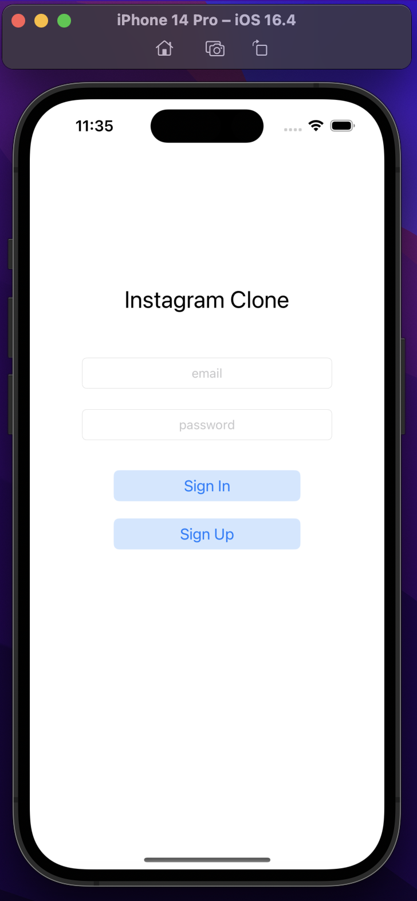
   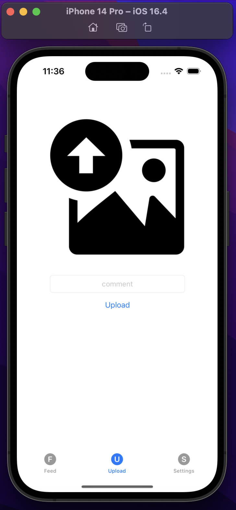
   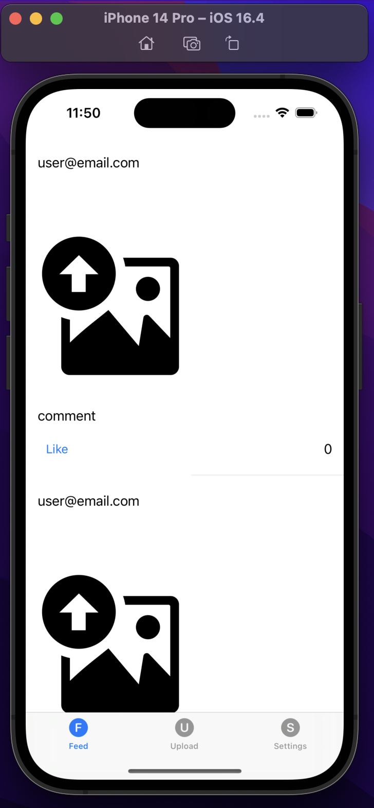
   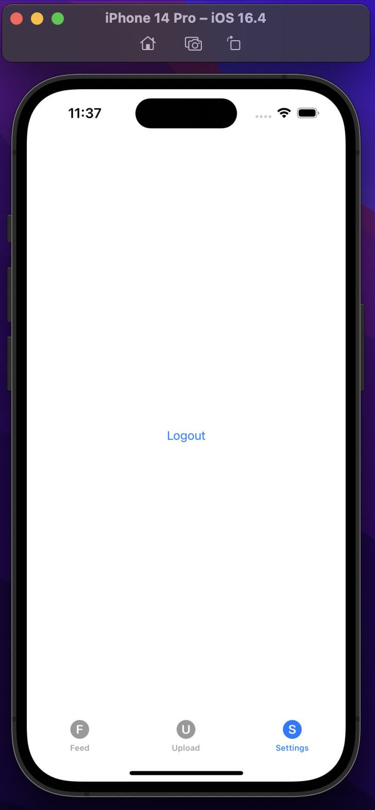

### 6th App
The goal of  application was to using <b>Machine Learning</b>, <b>CoreML</b>, <b>Vision</b>. It predicts what the object in the picture is using open source machine learning models. 

   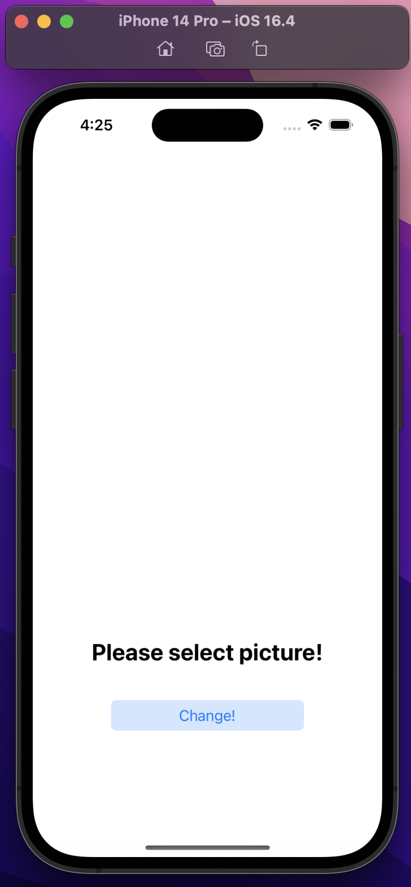
   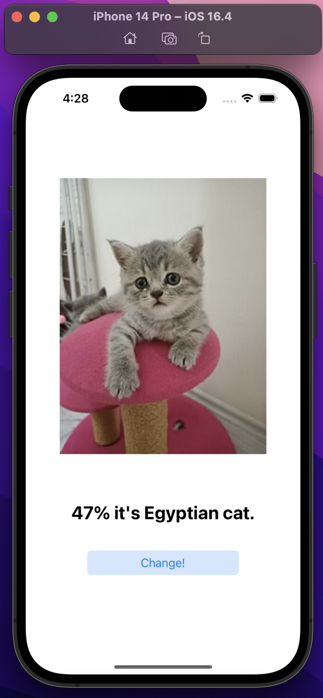
   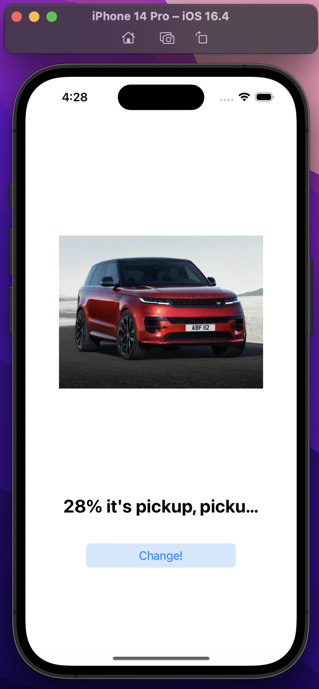
   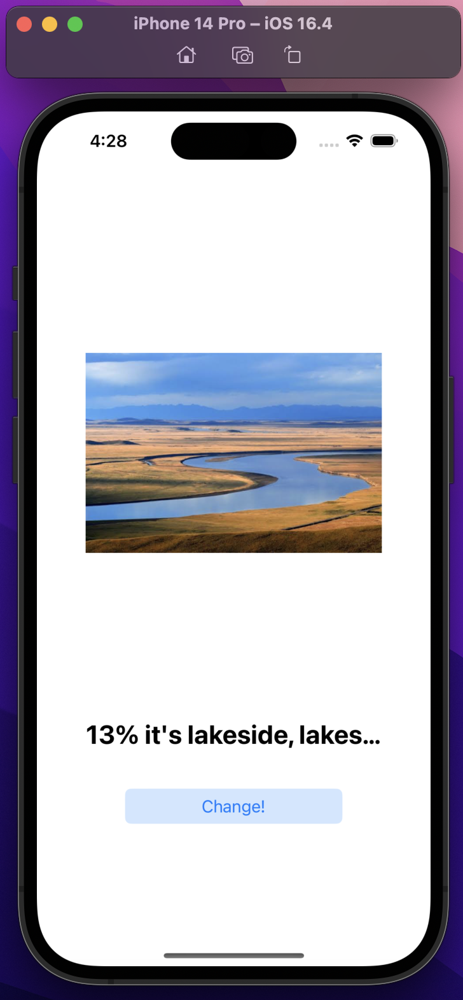

